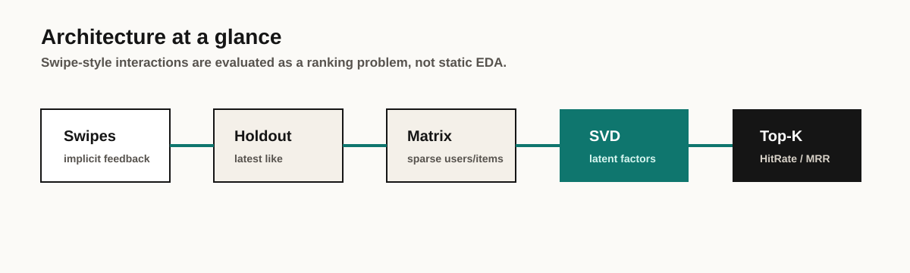

# Dating App Recommendation System

<div align="center">


[](https://github.com/MatthewPaver/dating-app-recommendation-system/actions/workflows/validate.yml)

**Collaborative filtering lab (swipe-style implicit feedback)**

*Notebook project with a lightweight CLI for evaluation and recommendation lookup*

</div>

---

## Portfolio Quick Read

| Section | Where to look |
|:---|:---|
| What it solves | Ranks unseen profiles from swipe-style implicit feedback instead of treating the dataset as static EDA |
| Quick start | `make demo` or [Quick Start](#quick-start) |
| Screenshot | [Portfolio Store](https://matthewpaver.github.io/MatthewPaver/store/) |
| Architecture | [Approach](#approach) |
| Tests | `make test` |
| Tech stack | `Python` `NumPy` `SciPy` `scikit-learn` `Jupyter` |


## Where this pattern shows up in real work

This is a **recommendation-systems lab**, not a dating product. The dating swipe story is just a familiar implicit-feedback shape.

| Scenario | How the lab maps |
| --- | --- |
| **Marketplace / shortlist ranking** | Positive interactions as implicit feedback; rank unseen items with Top-K |
| **Content or job recommendations** | Same CF path with a temporal holdout so you do not cheat with future clicks |
| **“What should we show next?” in ops tools** | Honest offline metrics before you wire an online loop |

Portfolio point: I can build and evaluate collaborative filtering under time, not only train a random-split notebook that looks artificially good.

## Status

`Notebook project`

## Reviewer Pack

| Area | Details |
|:---|:---|
| What it solves | Uses swipe-style implicit feedback to rank unseen profiles and evaluate recommendations with temporal holdouts. |
| Screenshot | [Portfolio Store preview](https://matthewpaver.github.io/MatthewPaver/store/preview.html?app=recommender) |
| Run locally | `make demo` runs evaluation and a sample recommendation lookup using included data. |
| Tests | `make test` |
| Demo data | Included at `examples/sample_swipes.csv`; larger synthetic datasets can be generated locally. |
| Architecture | CSV interactions -> positive implicit feedback -> temporal split -> sparse matrix -> SVD factors -> Top-K ranking |
| Limitations | Offline recommendation exercise, not a deployed recommender service with online feedback loops. |

## Practical Test

Can swipe history rank unseen profiles in a way that survives a temporal holdout?

The useful check is the full path:

1. Load swipe-style interaction data.
2. Treat positive swipes as implicit feedback.
3. Hold out each user's latest positive interaction.
4. Build sparse user/profile factors.
5. Measure whether the held-out profile appears in the Top-K ranking.

That is the point of the repo: evaluate the ranking behaviour, not claim a deployed dating product.

## Reviewer Notes

- **Reproducible path:** the notebook is the narrative walkthrough; `recommender.py` gives a CLI route for repeatable checks.
- **ML signal:** the project treats swipes as implicit feedback and evaluates ranking quality with a temporal holdout.
- **Evaluation signal:** Hit Rate@K and MRR@K are exposed through the CLI rather than hidden inside notebook cells.
- **Agent signal:** `recommendation_agents.py` adds fairness, diversity, and explanation reviewers around the deterministic recommender.
- **Known limit:** this is an offline recommendation exercise, not a deployed recommender service.

## Overview

Collaborative filtering recommendation system designed for swipe-based dating applications. Uses implicit feedback matrix factorisation (truncated SVD) to learn low-dimensional user and item embeddings from swipe data, then ranks unseen profiles by predicted affinity.

The notebook is the primary walkthrough. A lightweight CLI (`recommender.py`) provides a quick interface for dataset summary, model evaluation, and top-K lookups without opening Jupyter.

## Approach



- **Implicit feedback** — treats positive swipes as signal; passes and unseen profiles are not assumed negative
- **Truncated SVD** — learns 32-dimension user and item factors from a sparse interaction matrix
- **Temporal hold-out** — evaluates on each user's most recent like, simulating real-world prediction
- **Metrics** — Hit Rate@K and MRR@K (Mean Reciprocal Rank)

## Quick Start

```bash
git clone https://github.com/MatthewPaver/dating-app-recommendation-system.git
cd dating-app-recommendation-system
make demo
```

The repository contains only fictional sample data. `make synthetic` creates a larger deterministic dataset locally for the notebook and more substantial experiments.

### CLI

```bash
python recommender.py --csv examples/sample_swipes.csv summary
python recommender.py --csv examples/sample_swipes.csv evaluate --top-k 2
python recommender.py --csv examples/sample_swipes.csv recommend --user-id u1 --top-k 2
```

### Notebook

```bash
make notebook
```

This generates `data/synthetic_swipes.csv` and opens `recommendation_system_walkthrough.ipynb`. Run all cells for the full analysis walkthrough: data preprocessing, model training, recommendation generation, and evaluation.

### Synthetic data

```bash
make synthetic
python recommender.py --csv data/synthetic_swipes.csv evaluate --top-k 10
```

The generator is deterministic by default and supports `--users`, `--profiles`, `--interactions-per-user`, and `--seed`. Its identifiers and attributes are invented; they do not represent real people.

## Data Format

The system accepts a CSV with `decidermemberid`, `othermemberid`, `timestamp`, and `like`. Optional synthetic demographic and signup fields are used only by the notebook walkthrough. Only positive swipes (`like = 1`) are used as training signal.

## Example Output

Output from the included fictional sample:

```text
Dataset summary
Users: 3
Profiles: 4
Positive interactions: 9
Date range: 2021-01-01 09:00:00+00:00 -> 2021-01-01 11:30:00+00:00
```

The CLI also exposes model evaluation and top-K lookup:

```text
python recommender.py evaluate --top-k 10
python recommender.py recommend --user-id <USER_ID> --top-k 10
```

## Repository Layout

```text
recommendation_system_walkthrough.ipynb   Synthetic-data analysis notebook
synthetic_swipes.py                       Deterministic fictional-data generator
examples/sample_swipes.csv                Tiny fictional smoke-test dataset
recommender.py                            CLI for summary, evaluate, recommend
requirements.txt                          Python dependencies
```

## Notes

- This is a technical exercise, not a deployed product. The notebook discusses production considerations (serving, cold-start, feedback loops) as design thinking, not implemented features.
- No source or personal dataset is distributed. All committed examples are fictional.
- CPU is sufficient for training.

## License

Code and synthetic examples: MIT. See [`LICENSE`](LICENSE).
