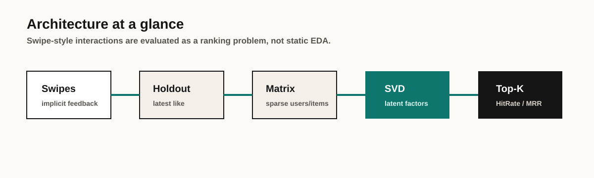

# Dating App Recommendation System

Test whether personalised recommendations beat a popularity baseline before building them into a product. This is a reusable offline evaluation lab, not a dating service. The swipe-shaped example can also represent positive interactions with articles, events or products.

**Start here:** [Run the included sample](#quick-start). No account, API key, model download or notebook is required. The sample is too small to establish model quality; its job is to make the evaluation and its failure cases inspectable.

<div align="center">


[](https://github.com/MatthewPaver/dating-app-recommendation-system/actions/workflows/validate.yml)

**Collaborative filtering lab (swipe-style implicit feedback)**

*Notebook project with a lightweight CLI for evaluation and recommendation lookup*

</div>

---

## Portfolio Quick Read

| Section | Where to look |
|:---|:---|
| What it solves | Ranks unseen profiles from swipe-style implicit feedback instead of treating the dataset as static EDA |
| Quick start | `make demo` or [Quick Start](#quick-start) |
| Portfolio | [Reusable templates](https://matthewpaver.github.io/work/#templates) |
| Architecture | [Approach](#approach) |
| Tests | `make test` |
| Tech stack | `Python` `NumPy` `SciPy` `scikit-learn` `Jupyter` |


## Where this pattern shows up in real work

This is a **recommendation-systems lab**, not a dating product. The dating swipe story is just a familiar implicit-feedback shape.

| Scenario | How the lab maps |
| --- | --- |
| **Marketplace / shortlist ranking** | Positive interactions as implicit feedback; rank unseen items with Top-K |
| **Content or job recommendations** | The same collaborative-filtering pattern, tested against each user's latest positive interaction |
| **“What should we show next?” in ops tools** | Honest offline metrics before you wire an online loop |

Portfolio point: I can build and evaluate collaborative filtering without hiding cold-catalog misses, and test whether personalisation actually beats a popularity baseline.

## Status

`Offline evaluation template`

## Reviewer Pack

| Area | Details |
|:---|:---|
| What it solves | Uses swipe-style implicit feedback to rank unseen profiles and evaluate recommendations with temporal holdouts. |
| Portfolio | [Reusable templates](https://matthewpaver.github.io/work/#templates) |
| Run locally | `make demo` runs evaluation and a sample recommendation lookup using included data. |
| Tests | `make test` |
| Demo data | Included at `examples/sample_swipes.csv`; larger synthetic datasets can be generated locally. |
| Architecture | CSV interactions -> positive implicit feedback -> temporal split -> sparse matrix -> SVD factors -> Top-K ranking |
| Limitations | Offline recommendation exercise, not a deployed recommender service with online feedback loops. |

## Practical Test

Can swipe history rank unseen profiles in a way that survives a temporal holdout?

The useful check is the full path:

1. Load swipe-style interaction data.
2. Treat positive swipes as implicit feedback.
3. Hold out each user's latest positive interaction.
4. Build sparse user/profile factors.
5. Measure whether the held-out profile appears in the Top-K ranking.

This is a per-user latest-interaction split, not a single global time cutoff. Other users' training interactions may occur after a held-out event. Use a global cutoff and time-available features before presenting results as a prospective evaluation.

That is the point of the repo: evaluate the ranking behaviour, not claim a deployed dating product.

## Reviewer Notes

- **Reproducible path:** the notebook is the narrative walkthrough; `recommender.py` gives a CLI route for repeatable checks.
- **ML signal:** the project treats swipes as implicit feedback and evaluates ranking quality with a temporal holdout.
- **Evaluation signal:** Hit Rate@K and MRR@K are exposed through the CLI rather than hidden inside notebook cells.
- **Evaluation signal:** the CLI compares SVD personalisation with a popularity baseline and reports Hit Rate, MRR, holdout eligibility, and recommendation coverage.
- **Known limit:** this is an offline recommendation exercise, not a deployed recommender service.

## Overview

Collaborative filtering recommendation system designed for swipe-based dating applications. Uses implicit feedback matrix factorisation (truncated SVD) to learn low-dimensional user and item embeddings from swipe data, then ranks unseen profiles by predicted affinity.

The notebook is the primary walkthrough. A lightweight CLI (`recommender.py`) provides a quick interface for dataset summary, model evaluation, and top-K lookups without opening Jupyter.

## Approach



- **Implicit feedback** — treats positive swipes as signal; passes and unseen profiles are not assumed negative
- **Truncated SVD** — learns 32-dimension user and item factors from a sparse interaction matrix
- **Per-user holdout** — evaluates on each user's most recent like; not a globally prospective simulation
- **Metrics** — Hit Rate@K, MRR@K, train-catalog eligibility, and recommendation coverage
- **Baselines** — deterministic random and popularity rankings use the same train catalogue, unseen-item filter and holdouts as SVD
- **Cold start** — an unseen user receives the popularity ranking; an unseen held-out item remains an explicit miss because it cannot be recommended from the train catalogue

## Quick Start

```bash
git clone https://github.com/MatthewPaver/dating-app-recommendation-system.git
cd dating-app-recommendation-system
make demo PYTHON=python3.11
```

The repository contains only fictional sample data. `make synthetic` creates a larger deterministic dataset locally for the notebook and more substantial experiments.

The demo now installs only the command-line and test dependencies from `requirements-cli.txt`. Jupyter and plotting packages are installed separately by `make notebook` (or `make install`).

The output compares SVD with deterministic random and popularity baselines. It reports total holdouts, train-known users and items, constraint reasons, cold-start fallbacks, and catalogue recommendation coverage. A zero lift is a valid result: do not assume personalisation is better.

Without Make, create a Python 3.11 environment, install `requirements-cli.txt`, and run the commands below with that environment's Python.

### CLI

```bash
.venv/bin/python recommender.py --csv examples/sample_swipes.csv summary
.venv/bin/python recommender.py --csv examples/sample_swipes.csv evaluate --top-k 2
.venv/bin/python recommender.py --csv examples/sample_swipes.csv recommend --user-id u1 --top-k 2
```

`evaluate` holds out each user's latest positive interaction. `recommend` instead fits all supplied positive history and excludes every previously liked item, including the latest one. A new user gets an explicitly labelled popularity fallback. Scores are ranking values, not probabilities of compatibility or satisfaction.

### Bring your own interactions

Use pseudonymous IDs and these four columns; other columns are not used:

```csv
decidermemberid,othermemberid,timestamp,like
001,article-7,2026-01-01T09:00:00Z,1
001,article-8,2026-01-02T09:00:00Z,0
```

This shows the format, not enough history to train a model. `like` must be 0 or 1; timestamps must be ISO dates or datetimes. Naive datetimes are interpreted as UTC. IDs are kept as text (including leading zeroes); surrounding whitespace is removed. Blank IDs, invalid dates and other like values stop the command with the CSV row and field to fix, rather than silently changing your dataset.

Run `summary` first. It accounts for input rows, ignored negative interactions, duplicate positive interactions and retained positives. Repeated positive user/item pairs keep the latest timestamp. For SVD you need at least two users and two liked items; evaluation additionally needs enough history after the per-user holdout. If that is not true, collect more representative interactions rather than treating a tiny example's score as evidence.

```bash
.venv/bin/python recommender.py --csv /path/to/interactions.csv summary
.venv/bin/python recommender.py --csv /path/to/interactions.csv evaluate --top-k 5
.venv/bin/python recommender.py --csv /path/to/interactions.csv recommend --user-id 001 --top-k 5
```

Commands are local and never upload the CSV. Keep private datasets outside the repository. Input/data errors return exit code 1; invalid command arguments return 2. Fix the reported field or history requirement and rerun; no source CSV is modified.

Windows PowerShell, without Make:

```powershell
py -3.11 -m venv .venv
.venv\Scripts\python.exe -m pip install -r requirements-cli.txt
.venv\Scripts\python.exe recommender.py summary
.venv\Scripts\python.exe recommender.py evaluate --top-k 2
```

### Notebook

```bash
make notebook
```

This generates `data/synthetic_swipes.csv` and opens `recommendation_system_walkthrough.ipynb`. Run all cells for the full analysis walkthrough: data preprocessing, model training, recommendation generation, and evaluation.

### Synthetic data

```bash
make synthetic
python recommender.py --csv data/synthetic_swipes.csv evaluate --top-k 10
```

The generator is deterministic by default and supports `--users`, `--profiles`, `--interactions-per-user`, and `--seed`. Its identifiers and attributes are invented; they do not represent real people.

### Optional public benchmark: MovieLens

MovieLens lets you test the same implicit-feedback ranking pipeline on a recognised public recommendation dataset. It is **not** dating-app data, so it evaluates the reusable ranking method rather than validating a dating product or compatibility model.

Read the [GroupLens MovieLens terms](https://grouplens.org/datasets/movielens/) before running:

```bash
make movielens
python recommender.py --csv data/movielens/interactions.csv evaluate --top-k 10
```

The downloader requires `--accept-terms`, downloads `ml-latest-small` directly from GroupLens, maps ratings of 4.0 or above to positive implicit interactions, and records source/output SHA-256 hashes in `data/movielens/provenance.json`. The archive and converted data remain ignored; this repository does not redistribute MovieLens.

## Data Format

The system accepts a CSV with `decidermemberid`, `othermemberid`, `timestamp`, and `like`. Optional synthetic demographic and signup fields are used only by the notebook walkthrough. Only positive swipes (`like = 1`) are used as training signal.

## Example Output

Output from the included fictional sample:

```text
Dataset summary
Users: 3
Profiles: 4
Positive interactions: 9
Date range: 2021-01-01 09:00:00+00:00 -> 2021-01-01 11:30:00+00:00
```

The CLI also exposes model evaluation and top-K lookup:

```text
python recommender.py evaluate --top-k 10
python recommender.py recommend --user-id <USER_ID> --top-k 10
```

## Repository Layout

```text
recommendation_system_walkthrough.ipynb   Synthetic-data analysis notebook
synthetic_swipes.py                       Deterministic fictional-data generator
scripts/download_movielens.py             Opt-in public benchmark adapter
examples/sample_swipes.csv                Tiny fictional smoke-test dataset
recommender.py                            CLI for summary, evaluate, recommend
requirements.txt                          Python dependencies
```

## Notes

- This is a technical exercise, not a deployed product. The tiny sample is a smoke test, not evidence of model quality; use generated or permitted interaction data and repeated temporal splits for a substantive comparison.
- No source or personal dataset is distributed. All committed examples are fictional.
- MovieLens is an optional generic benchmark downloaded under its own terms; it does not support claims about dating compatibility, fairness, or online user outcomes.
- CPU is sufficient for training.

## License

Code and synthetic examples: MIT. See [`LICENSE`](LICENSE).
